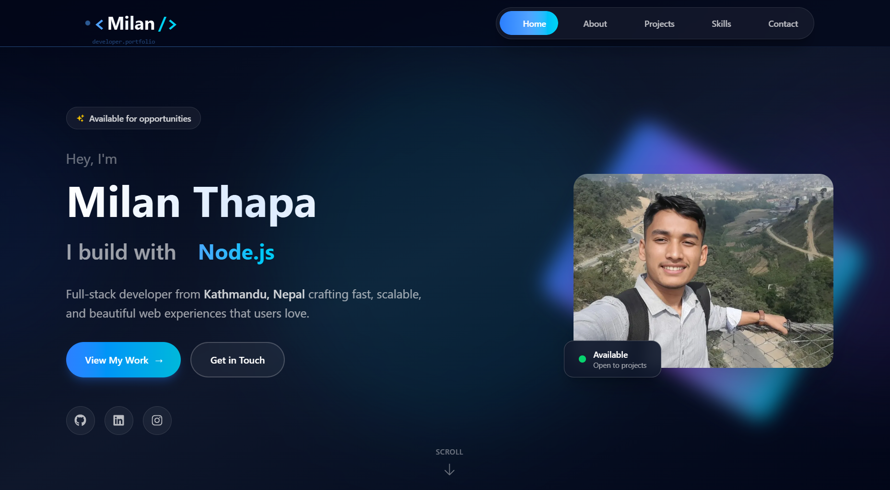

# 🌐 Milan Thapa Portfolio

   

---

## 📖 Table of Contents

- [About the Project](#about-the-project)  
- [Demo](#demo)  
- [Features](#features)  
- [Projects](#projects)  
- [Tech Stack](#tech-stack)  
- [GitHub Stats](#github-stats)  
- [Getting Started](#getting-started)  
- [Deployment](#deployment)  
- [Roadmap](#roadmap)  
- [Contact](#contact)  
- [License](#license)  

---

## 🌟 About the Project

This is the **personal portfolio of Milan Thapa**, showcasing my skills, projects, and achievements.  

**Purpose:**  
- Present professional projects & skills  
- Provide easy ways to contact & collaborate  
- Demonstrate frontend development expertise  
- Serve as a personal branding platform  

**Website highlights:**  
- Fast, responsive, and SEO-friendly  
- Interactive UI with animations  
- Optimized performance and font loading  

**Live website:** [https://www.milanthapa1.com.np](https://www.milanthapa1.com.np)  

---

## 🎬 Demo

**Portfolio in Action:**  
[](https://www.milanthapa1.com.np)


**Screenshots Carousel:**  
| Homepage | Projects Section | Contact Section |
|----------|-----------------|----------------|
|  |  |  |


## ✨ Features

- 💻 Fully responsive & mobile-friendly  
- ⚡ Built with **Next.js 13+** & **TypeScript**  
- 🎨 Smooth animations & interactive UI  
- 🌐 SEO-optimized metadata & structured content  
- 🔗 Easy navigation between sections  
- 🚀 Fast page load & caching  
- 📱 Showcase projects, skills, & contact info  
- 🛠 Ready for deployment on **Vercel**  

---

## 💼 Projects

| Project | Description | Live Demo |
|---------|-------------|-----------|
| Portfolio Website | Personal branding & showcase | [Live Site](https://www.milanthapa1.com.np) |
| MilanEdu|  College Website | [Live Site ](https://milanedu.netlify.app/) |
| HamroCSIT Clone  | An Educational website for CSIT students  | [Live Site](https://hamrocsit.netlify.app/) |

> Add more projects as your portfolio grows.

---

## 🛠 Tech Stack

| Frontend        | Libraries & Tools | Deployment |
|-----------------|-----------------|------------|
|  | Tailwind CSS / CSS Modules |  |
| TypeScript      | Framer Motion / React Icons |            |
| React           |                     |            |

---

## 📊 GitHub Stats


**Visitor Count:**  


## ⚡ Getting Started

### Prerequisites

- Node.js >= 18  
- npm / yarn / pnpm / bun  

### Installation

```bash
# Clone the repository
git clone https://github.com/yourusername/portfolio-website.git
cd portfolio-website

# Install dependencies
npm install
# or
yarn install
# or
pnpm install

# Run development server
npm run dev
Open http://localhost:3000 in your browser.

🚀 Deployment
Deploy your portfolio easily using Vercel:

npm i -g vercel
vercel
More info: Next.js Deployment Docs

🛣 Roadmap
✅ Initial Next.js & TypeScript setup

✅ Add portfolio & projects showcase

✅ Add optimized fonts & SEO metadata

⏳ Add blog / CMS integration

⏳ Enhance animations & interactivity

⏳ Improve SEO & performance metrics

⏳ Add analytics & tracking

📬 Contact
Milan Thapa

🌐 Website: https://www.milanthapa1.com.np

📧 Email: thapamilan9762@gmail.com

💼 LinkedIn: https://www.linkedin.com/in/milanthapa1/


📝 License
This project is licensed under the MIT License. See LICENSE for details.

Made with ❤️ using Next.js
